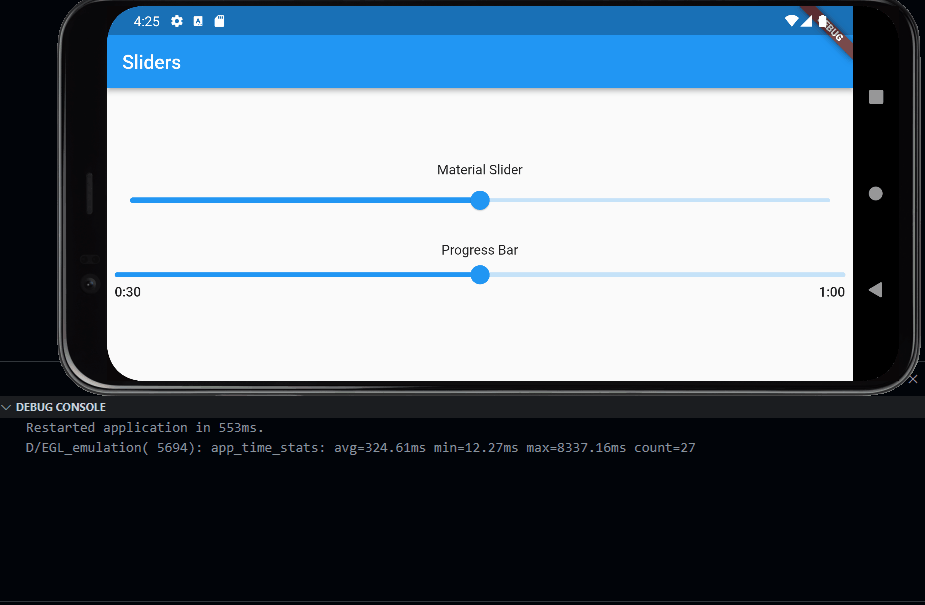

# gesture_playground

A Flutter project to test gesture competition between widgets

## Scope

The project compares the gesture capturing behavior between a Flutter material Slider and a Custom Rendered [Progress Bar](https://pub.dev/packages/audio_video_progress_bar/example)

The resulting behavior is captured in the following gif:

Both the Material Slider and the ProgressBar compete with the PageView for the Horizontal Drag Gesture. But the Material successful captures the gesture, whereas the ProgressBar loses to the PageView.
 
